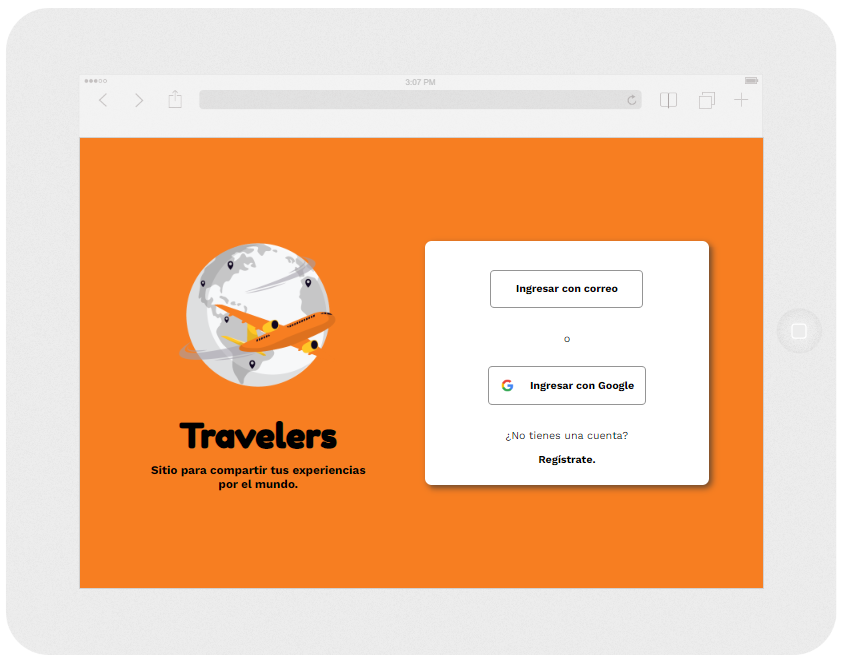
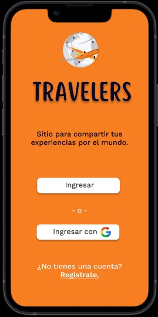

# Travelers

Sitio para compartir tus experiencias por el mundo.

## Índice

* [1. Introducción](#1-Introducción)
* [2. Historias de usuarios](#2-resumen-del-proyecto)
* [3. Prototipos](#3-objetivos-de-aprendizaje)
* [4. Resultados de los test de usabilidad](#4-consideraciones-generales)
* [5. Detalles técnicos](#5-criterios-de-aceptación-mínimos-del-proyecto)
* [Colaboradoras](#6-hacker-edition)

## 1. Introducción

*Travelers* es una red social creada para todos los viajeros del mundo. Allí podrán compartir y encontrar las experiencias de otras personas de cualquier país, así mismo, intectuar con otros usuarios por medio de comentarios y likes.

## 2. Historias de usuarios

**Yo como usuario quiero iniciar sesión en *Travelers***

* El usuario puede registrarse con correo electronico o por medio de Google.
* El usuario puede iniciar sesión con correo y contraseña, o con la opción de Google.
* La contraseña que introduce el usuario es secreta.
* Muestra mensaje de error en diferentes escenarios por parte del usuario. (Contraseña incorrecta, correo ya registrado, contrañesa débil al registrarse, etc.)
* No se repiten usuarios con el mismo correo.

**Yo como usuario quiero visualizar el Timeline en *Travelers***

* Al recargar la aplicación, se verifica si el usuario está logueado antes de mostrar contenido.
* El usuario puede publicar un post.
* Al publicar, se valida que exista contenido en el input del post.
* Poder dar y quitar like a una publicación. Máximo uno por usuario.

**Yo como usuario quiero editar y borrar posts en el Timeline en *Travelers***

* El usuario puede eliminar un post específico.
* Al dar click para editar un post, el usuario puede cambiar el texto por un input que permita editar el texto y luego guardar los cambios.
* Al guardar los cambios cambia a un texto normal pero con la información editada.
* Al recargar la página el usuario puede ver los textos editados.
* El usuario puede cerrar sesión.

## 3. Prototipos

Para ver nuestro prototipo *Mobile First*: [aquí.](https://www.figma.com/proto/aUbKkH2hKJFEREZaESHRz9/Social-Network?scaling=scale-down&page-id=0%3A1&starting-point-node-id=1%3A2&show-proto-sidebar=1&node-id=1%3A2).

## 4. Resultados de los test de usabilidad

Los test de usabilidad se realizaron bajo el protitipo Mobile First por medio de la herramienta Maze, donde se encuento a un grupo de personas por medio de pruebas rápidas que simulaban la experiencia del usuario sobre cada click de la interfaz.

En el informe final de la plataforma logramos 17 respuestas con un número de 5 bloqueos. En los resultados finales se permitió evidenciar:

* Éxito promedio del 40,0%.
* Una duración media de 23,3 segundos.
* Tasa de clicks erróneos de 55,0%.
* Una puntuación de usabilidad del 55%.

## 5. Detalles técnicos

Para este proyecto se implementó lo siguiente:

* SPA (Single Page Application)
* Firebase y Cloud Firestore.
* Vanilla JS.
* CSS y HTML Semántico.
* Jest (Test Unitarios).

## Colaboradoras

[Camila Fonseca](https://github.com/Camilaf19) | [Tania Infante](https://github.com/Tania1295) | [Yeimmy Lopez](https://github.com/VanesaLo)
